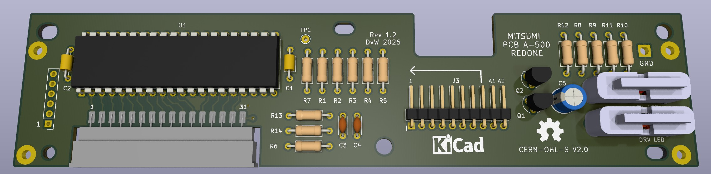
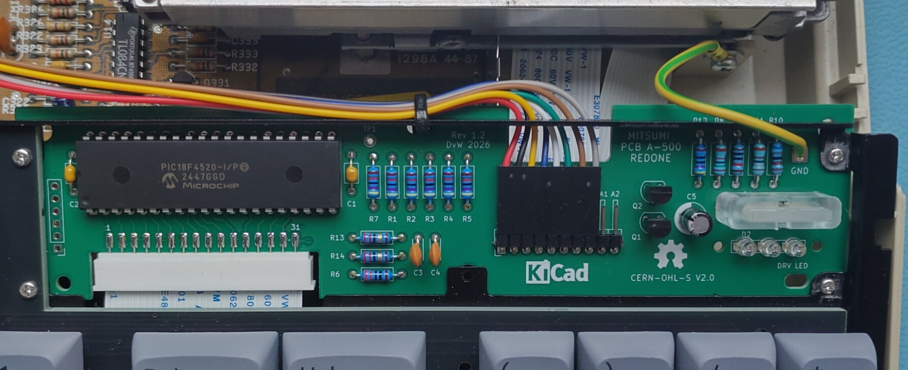
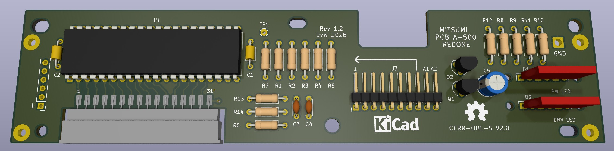
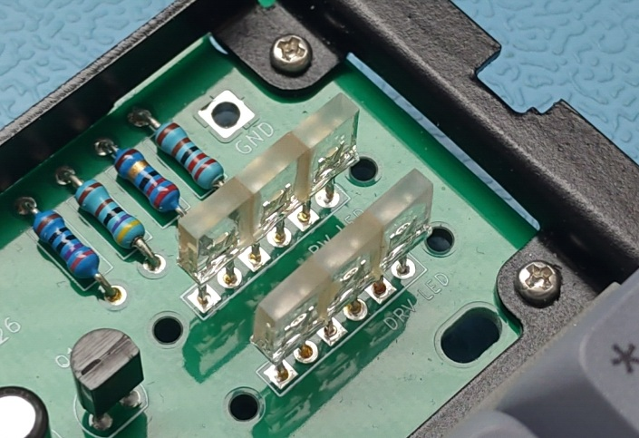

# Mitsumi PCB A-500 redone

This is a remake ("redone") of the Amiga 500 Mitsumi keyboard controller.

The original Amiga 500 uses a MOS 6570 microcontroller that is no longer produced and therefore getting exceedingly rare. They are also starting to fail, resulting in the dreaded "blinking CAPS-LOCK" issue. Since there was no open-source / open-hardware replacement design available I decided to make my own.

This is a completely new "from scratch" design that uses a Microchip [PIC18F4520](https://www.microchip.com/en-us/product/pic18f4520) microcontroller. I chose this type as it is available in a DIP40 package that is easy to solder by hand. It also gives this new redone keyboard controller a very similar look like the original controller. 

Lastly, what I like about the PIC18F4520 is that it is an 8bit microcontroller with modest capabilities not unlike the MOS 6570. It would bother me a bit to use a 50MHz+ 32bit ARM processor that is magnitudes faster than the Amiga's 68000 CPU just to scan a keyboard.

## Features

* Completely independent design.
* Fully compatible with the original Mitsumi keyboard controller.
* Debouncing filter.
* Anti-ghosting filter.
* Dimming power LED that also works on older Amiga 500 motherboard revisions.
* Through-hole design using currently available components for a retro look.
* Uses three 5mm x 2mm x 7mm LEDs instead of the unobtanium Commodore 15mm LED.
* Optionally, a 3D printed lightguide can be used to give a cleaner LED look.

## Molex ZIF connector

The original keyboard controller uses a Molex right angle ZIF connector to connect to the keyboard matrix membrane. This connector is very hard (impossible?) to get. I therefore used the straight version of this connector, the [Molex 39-53-2315](https://www.molex.com/en-us/products/part-detail/39532315). This connector is soldered on the edge of the circuitboard. This causes the entry point of the connector to sit lower than the original. This puts some strain on the flat cable and one should therefore take care when assembling the keyboard.

## LED brightness tuning

Modern LEDs are way brighter than the LEDs that Commodore used back in the days.
If the LEDs turn out too bright, they can be tuned by changing some resistor values.

### Drive LED

The drive LEDs can be tuned by simply changing resistor R12. Higher values lower the brightness.

### Power LED

The power LEDs are a bit special. One cannot simply use a larger than original current limiting resistor. This is because of the power LED dimming function on later revisions of the Amiga 500. Simply using a larger current limiting resistor would make the dimming hardly noticeable causing the power LEDs to always shine at seemingly full brightness.

To solve this, the circuit around Q1/Q2 has been added. This circuit detects when the LEDs should be dimmed or not. If the Amiga turns the LEDs on (full brightness on later revisions), only Q2 will conduct and deliver current to the LEDs via both R10 and R11. When the Amiga turns the LEDs off (dimmed on later revisions), only Q1 will conduct and current to the LEDs is only delivered via R10. The power LEDs will be dimmed.

For a good dimming effect, R10 should be about 4 times bigger than R11. This gives a current ratio of about 1:5.
In order to reduce or increase the brightness both resistors should thus be changed. Higher values lower the brightness.

## Building

The board is a completely through-hole design and should thus be easy to build. 
The BOM contains some partnumbers for the resistors but one can use any brand. None of the components are critical.

For the LEDs one can use 3 5mm x 2mm LEDs. These are still available. The top of these LEDs should sit above 12.3mm above the PCB. 
Alternatively, 3mm ("flat top") LEDs can be used combined with a 3D printed light guide. I had mine printed by JLC3DP using the 8001 "translucent" resin. The LEDs should be soldered close to the PCB to make this fit. Be aware though that the 8001 resin is not UV resistant on the long term. However, so far my light guides are holding up well.

To connect the keyboard controller to the main board a 300mm 8pin DuPont cable assembly can be used. The pinheader for this cable has 10 pins instead of 8. The extra pins are "auxiliary" pins meant for future expansions and not currently implemented. Therefore connect the keyboard cable only to pins 1..8 as indicated by the arrow.

## Firmware and programming

The firmware was developed using [MPLAB X ide v6.25](https://www.microchip.com/en-us/tools-resources/develop/mplab-x-ide).
The code is written in C for the [XC8 compiler](https://www.microchip.com/en-us/tools-resources/develop/mplab-xc-compilers/xc8).
These tools are freely available from [Microchip](https://www.microchip.com).

## Pictures

Picture of lightguide version mounted on an mechanical keyboard. The drive lightpipe has been removed to show the 3 flat top 3mm LEDs. You can also see how the groundstrap is supposed to connect. 

Render of version using three 5mm x 2mm LEDs

Closeup of version with 5mm x 2mm LEDs. On this picture I glued the LEDs together using an UV curable glue. These LEDs were originally fully transparant but I sanded the tops with sandpaper to get a more diffuse look.

## Licenses

The hardware is licensed under [CERN OHL-S V2.0](https://cern-ohl.web.cern.ch/).
The firmware is licensed under [GNU GPL V3](https://www.gnu.org/licenses/gpl-3.0.en.html).

## Acknowledgements

The KiCad keyboard schematic symbol was originally done by [Scott Lawrence](https://github.com/BleuLlama/AmigaSchematics/tree/master/A500_kyb_Mitsumi).

